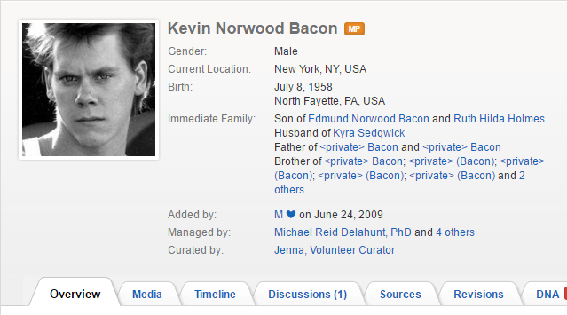
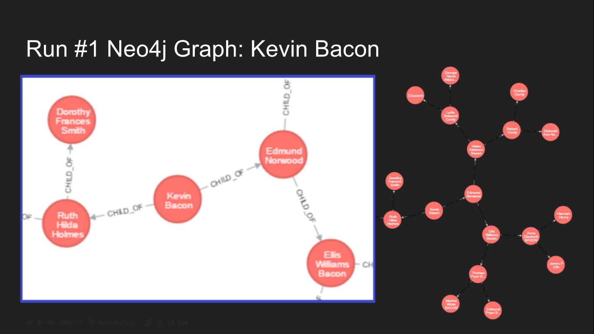
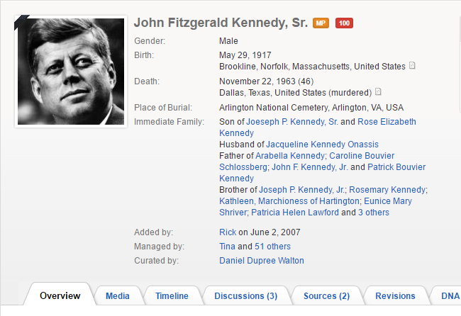
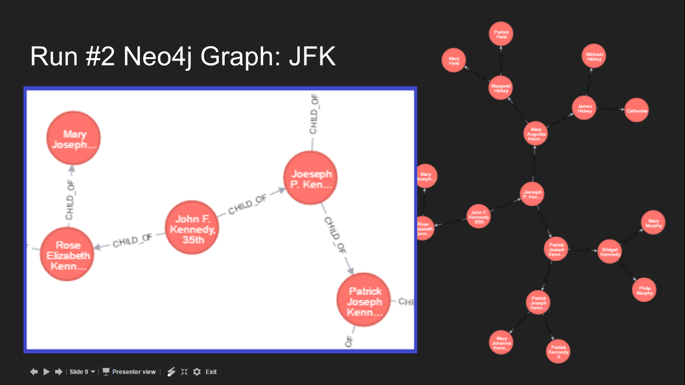

# Social Network Investigation


### Investigate a social network that is of interest to you: ***GENI***

Carefully define what the vertices represent and what the edges represent.

***EDGES: In this model, the edges represent a parent-child relationships***

***NODES: In this model, each node represents a person***

Are there any new modeling techniques that you had to emply?

***No new modelling techniques, just the scraping, the graph, and the Neo4j storage of the graph.***

```{r message=FALSE, warning=FALSE, echo=FALSE}
library(rvest)
library(knitr)
library(RNeo4j)

NEO4J_GRAPH_URL <- 'http://localhost:7474/db/data/'
graph = startGraph(NEO4J_GRAPH_URL, username="neo4j", password="neo5j")
clear(graph, FALSE)

addConstraint(graph, "Person", "name")
addConstraint(graph, "Person", "link")

NUM_GENERATIONS <- 3

get_geni <- function(source_person, this_name, this_link, gen_num){

  for(spaces in c(1:gen_num)){
    cat("\t")
  }
  cat("[",gen_num,"]",this_name,"\n")

  page_node <- html(this_link)
  fam_links <- page_node %>% html_nodes("#family_handprint a")
  for(i in c(1:2)){
    f <- fam_links[i]
    next_name <- f %>% html_text()
    next_link <- f %>% html_attr("href")
    if(!endsWith(next_link, "#")){
      curr_time <- format(Sys.time(), "%H:%M%:s")
      found_person = getOrCreateNode(graph, "Person", name=next_name, link=next_link, time=Sys.time(), gen_above=gen_num)
      relative_rel = createRel(source_person, "CHILD_OF", found_person)
      if(gen_num <= NUM_GENERATIONS){
        gen_above <- gen_num + 1
        get_geni(found_person, next_name, next_link, gen_above)
      }
    }
  }
  return (df)
}
```

# Start Node: Kevin Bacon:



```{r message=FALSE, warning=FALSE, echo=FALSE}
start_name_1 <- "Kevin Bacon"
start_page_1 <- "https://www.geni.com/people/Kevin-Bacon/6000000009325127022"
the_person_1 = createNode(graph, "Person", name=start_name_1, link=start_page_1, time=Sys.time(), gen_above=0)
geni_run_1 <- get_geni(the_person_1, start_name_1, start_page_1, 1)

```



```{r message=FALSE, warning=FALSE, echo=FALSE}
sprintf('Finished Kevin Bacon')
```


# Start Node: JFK



```{r message=FALSE, warning=FALSE, echo=FALSE}
start_name_2 <- "John F. Kennedy, 35th President of the USA"
start_page_2 <- "https://www.geni.com/people/John-F-Kennedy-35th-President-of-the-USA/6000000002880912606"
the_person_2 = createNode(graph, "Person", name=start_name_2, link=start_page_2, time=Sys.time(), gen_above=0)
geni_run_2 <- get_geni(the_person_2, start_name_2, start_page_2, 1)
```




```{r message=FALSE, warning=FALSE, echo=FALSE}
sprintf('Finished JFK')
```

\newpage

# All Code:

```{r code=readLines(knitr::purl('SocialNetwork.Rmd', documentation = 0)), eval = FALSE}

```
