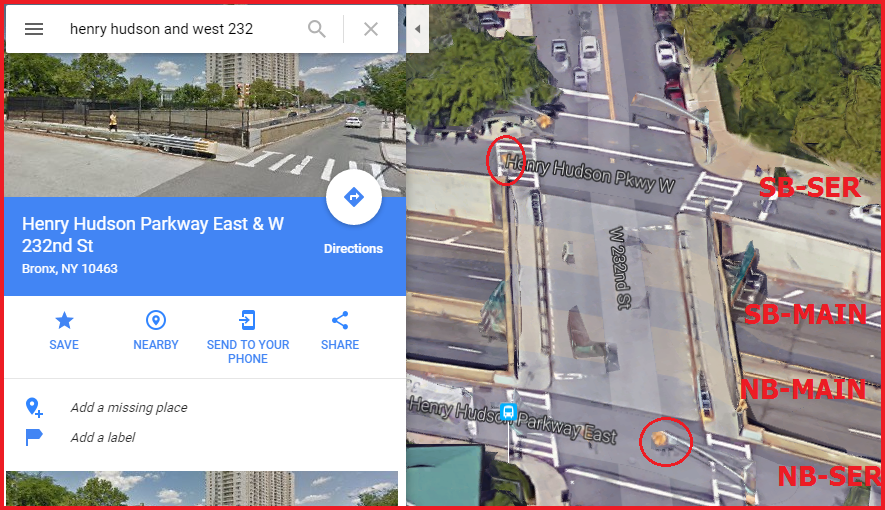
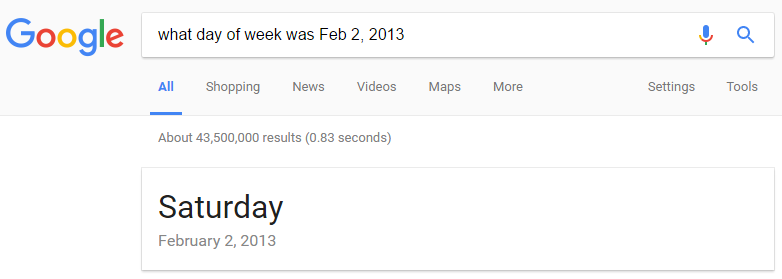

Section 5.5 #3 (p222) - Pick a traffic intersection with a traffic light.  Collect data on vehicle arrival times and clearing times.  Build a Monte Carlo simulation to model traffic flow at this intersection

Note: traffic at the intersection will be analyzed for both the main road (highway, no traffic lights) and the service roada (with traffic lights)

```{r warning=FALSE, message=FALSE, echo=FALSE}
HOUR_OF_DAY_TO_USE <- 4
SAMPLE_DATE <- '02/05/2013'
NUM_RUNS_TO_PERFORM <- 10000#0
```

### The Intersection and Traffic Lights (Arial):

(4 Directions: NB-MAIN, SB-MAIN, NB-SER[vice], SB-SER[vice])



### The Intersection and Traffic Lights (Map):


### ALL data for sample date: (`r SAMPLE_DATE`)

```{r warning=FALSE, message=FALSE, echo=FALSE}
library(ggplot2)
library(knitr)
library(sqldf)

traffic <- read.csv(file="Traffic_Volume_Counts__2012-2013_.csv",header=TRUE,sep=",");

names(traffic) <- gsub(".", "_", names(traffic), fixed = TRUE)

colnames(traffic)[which(names(traffic) == "From")] <- "xFrom"
colnames(traffic)[which(names(traffic) == "To")] <- "xTo"
colnames(traffic)[which(names(traffic) == "Roadway Name")] <- "Roadway_Name"

all_data <- sqldf("select * from traffic where Roadway_Name = 'HENRY HUDSON PKWY' and direction in ('NB-MAIN','SB-MAIN','NB-SER','SB-SER') and xTo = 'W 232nd ST' and Date like '%2013' order by trim(xFrom)")

for(new_col_name in c(8:31)){
  colnames(all_data)[new_col_name] <- (new_col_name-7)
}

kable(all_data[all_data$Date == SAMPLE_DATE,])
```

### Transform (Reshape) to Long Format:

(with DATE and HOUR fields.)

```{r warning=FALSE, message=FALSE, echo=FALSE}

library(reshape2)
all_data <- melt(all_data, id.vars = c("ID", "Segment_ID", "Roadway_Name", "xFrom", "xTo", "Direction", "Date"))

colnames(all_data)[8] <- "HOUR"

all_data <- all_data[order(all_data$Date, all_data$HOUR, all_data$Roadway_Name, all_data$xFrom, all_data$xTo),] 

# SHOW THAT THE RESHAPE WORKED AS PLANNED
kable(head(all_data[all_data$Date == SAMPLE_DATE,], n=10))

```

### HOURLY data for sample date: (`r SAMPLE_DATE`)

```{r warning=FALSE, message=FALSE, echo=FALSE}
ggplot(data=all_data[all_data$Date == SAMPLE_DATE,], aes(x=HOUR, y=value, group=Direction, shape=Direction, color=Direction)) + ggtitle("TRAFFIC - ALL HOURS") + geom_line() + geom_point()

```

Hourly data is NOT RANDOM, so Monte Carlo simulation not applicable.  Let's Analze traffic ONLY in ***`r HOUR_OF_DAY_TO_USE`th*** HOUR OF THE DAY across multiple days, since perhaps the daily traffic levels will be RANDOM AT THAT TIME and Monte Carlo simulation will then be applicable:

```{r warning=FALSE, message=FALSE, echo=FALSE}
ggplot(data=all_data[all_data$HOUR == HOUR_OF_DAY_TO_USE,], aes(x=Date, y=value, group=Direction, shape=Direction, color=Direction)) + ggtitle(paste("TRAFFIC in HOUR = ",HOUR_OF_DAY_TO_USE)) + geom_line() + geom_point() + theme(axis.text.x = element_text(angle = 90, hjust = 1))

```

Seems to have some days that are not random, why?



* Feb 2 and 3 in were Saturday and Sunday
* This explains the extra valume
* So let's only look at the last 4 for rush hour analysis.

### North/South TRAFFIC DATA at HOUR #`r HOUR_OF_DAY_TO_USE`:

```{r warning=FALSE, message=FALSE, echo=FALSE}
weekdays_data <- all_data[all_data$HOUR == HOUR_OF_DAY_TO_USE,]
#DATES_TO_USE <- c('02/01/2013','02/04/2013','02/05/2013','02/06/2013','02/07/2013')
DATES_TO_USE <- c('02/04/2013','02/05/2013','02/06/2013','02/07/2013')
weekdays_data <- weekdays_data[weekdays_data$Date %in% DATES_TO_USE,]

ggplot(data=weekdays_data, aes(x=Date, y=value, group=Direction, shape=Direction, color=Direction)) + ggtitle(paste("WEEKDAY TRAFFIC at HOUR",HOUR_OF_DAY_TO_USE)) + geom_line() + geom_point() + theme(axis.text.x = element_text(angle = 90, hjust = 1))

```

It seems more possible that these values are random, so let's inspect the data for a single day:

```{r warning=FALSE, message=FALSE, echo=FALSE}
single_weekday_data <- weekdays_data[weekdays_data$Date == SAMPLE_DATE,]

kable(sqldf("select *  from single_weekday_data order by Direction, xFrom, xTo"))
```


## Monte Carlo Simulation:

Find p-value for ***null hypothesis***: "In hour ***`r HOUR_OF_DAY_TO_USE`*** on a weekday, the northbound and southbound traffic are equal."  

```{r warning=FALSE, message=FALSE, echo=FALSE}
nb_sb_for <- function(NB_TEXT_VAL, SB_TEXT_VAL){
  nb_sum <- sum(weekdays_data[weekdays_data$Direction == NB_TEXT_VAL, ]$value)
  nb_sum
  sb_sum <- sum(weekdays_data[weekdays_data$Direction == SB_TEXT_VAL, ]$value)
  sb_sum
  
  total_traffic_count_main <- nb_sum + sb_sum
  nb_sum_samples <- c()
  count_over_threshold <- 0
  for(run_num in 1:NUM_RUNS_TO_PERFORM){
    total_1s <- sum(sample(c(0,1),total_traffic_count_main,replace = TRUE))
    nb_sum_samples <- c(nb_sum_samples,total_1s)
    # 2-sided p-test
    if(total_1s >= nb_sum || total_1s <= sb_sum){
      count_over_threshold <- count_over_threshold + 1
    }
  }

  hist(nb_sum_samples, xlab = paste(NB_TEXT_VAL," and ", SB_TEXT_VAL), main = paste(count_over_threshold,"/",NUM_RUNS_TO_PERFORM,"over 4AM count"))
  return (count_over_threshold/NUM_RUNS_TO_PERFORM)
}

par(mfrow=c(1,2))
main_probs <- nb_sb_for('NB-MAIN','SB-MAIN')
service_probs <- nb_sb_for('NB-SER','SB-SER')
```

### Therefore:

The probability that ***MAIN*** road fits null hypothesis (no direction bias) at hour ***`r HOUR_OF_DAY_TO_USE`*** is: ***`r main_probs`***

The probability that ***SERVICE*** road fits null hypothes (no direction bias) at hour ***`r HOUR_OF_DAY_TO_USE`*** is: ***`r service_probs`***

## All Code:

```{r code=readLines(knitr::purl('IntersectionData.Rmd', documentation = 0)), eval = FALSE}

```
