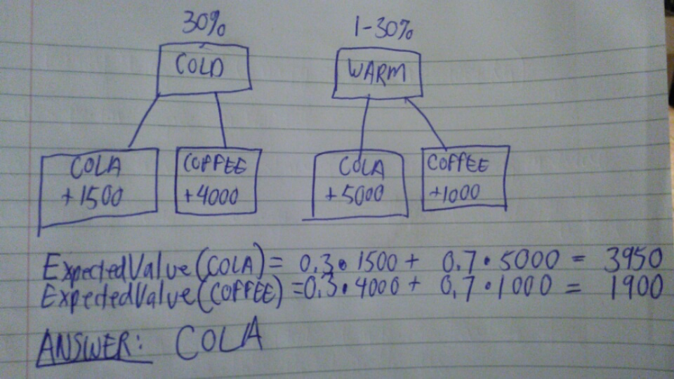
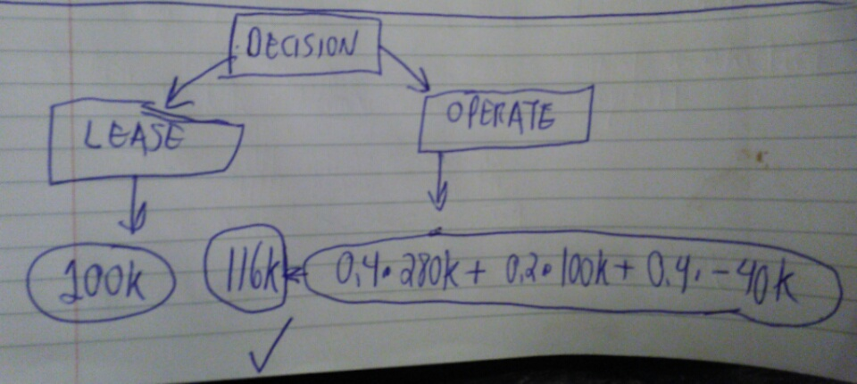
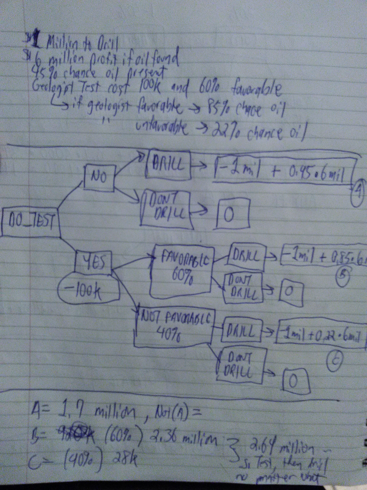

# Page 347: #4

```{r error=FALSE, warning=FALSE}
biz_venture_expected_value <- (2/5)*55000 + (3/5)*(-1750)
biz_venture_expected_value
```

# Page 347: #6



# Page 355: #3




# Page 364: #3

Answer: test and then drill regardless of test results...



# Page 373: #1

a) Row b has highest expected value:

```{r error=FALSE, warning=FALSE}
col_probabilities <- c(0.35, 0.3, 0.25, 0.1)
row_A_pay <- c(1100, 900, 400, 300)
row_B_pay <- c(850, 1500, 1000, 500)
row_C_pay <- c(700, 1200, 500, 900)

sum(col_probabilities %*% row_A_pay)
sum(col_probabilities %*% row_B_pay)
sum(col_probabilities %*% row_C_pay)
```

b) Regret Table: Row B minimizes the expected regret:

```{r error=FALSE, warning=FALSE}
df <- t(data.frame(row_A_pay, row_B_pay, row_C_pay))
df
df[,1] <- max(df[,1]) - df[,1] 
df[,2] <- max(df[,2]) - df[,2] 
df[,3] <- max(df[,3]) - df[,3] 
df[,4] <- max(df[,4]) - df[,4]
df <- df * col_probabilities
df[,1] + df[,2] + df[,3] + df[,4]


``` 